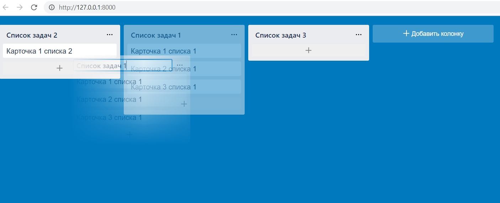
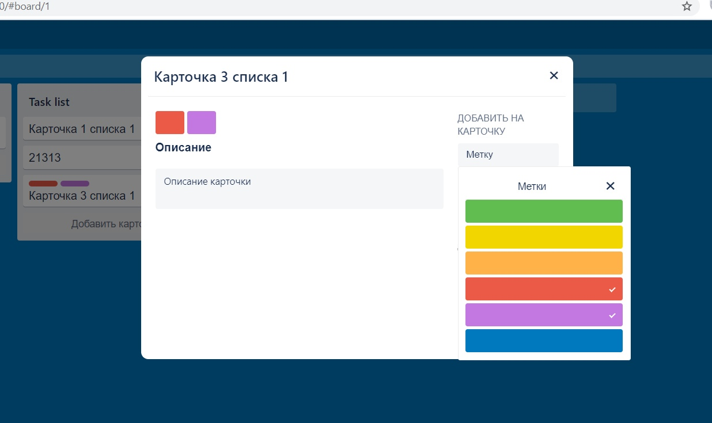
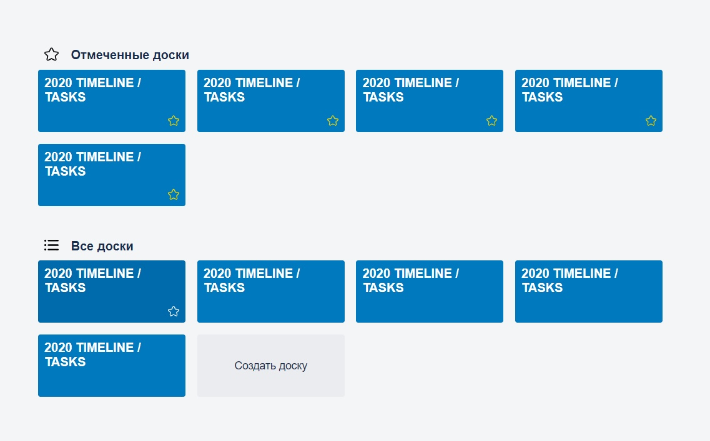

# Previews

# Project setup (Windows):
* `git clone https://github.com/IncomprehensibleGuy/trello-clone.git`
* `cd trello-clone && npm i`
* `cd backend && python -m venv venv`
* `cd venv/Scripts && activate && cd ../..`
* `pip install -r requirements.txt`

# Run project:
* start api server: `npm run server`
* start dev mode: `npm run dev`
